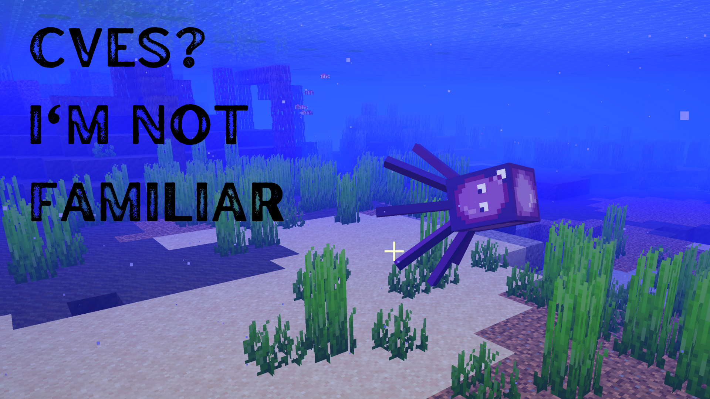
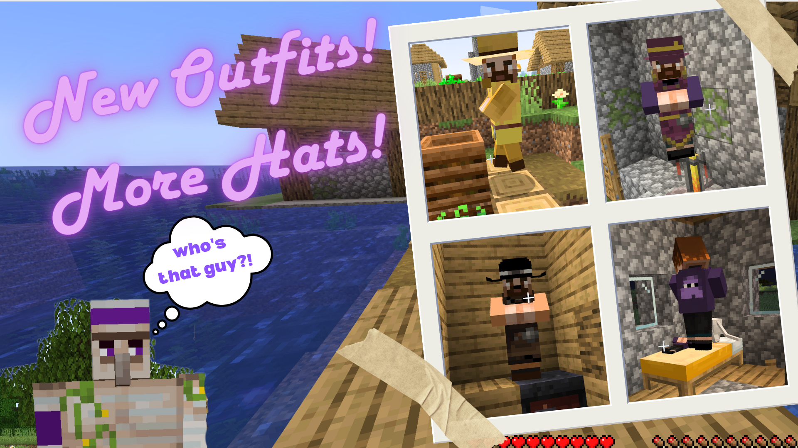

# GuardCraft - a Containerized Minecraft Server

GuardCraft is a containerized Minecraft (Java) server built on top of the [Java JRE Chainguard Image](https://images.chainguard.dev/directory/image/jre/versions). This is a demo that showcases the capabilities of the Chainguard Java JRE image, which is a minimal Java runtime environment with low-to-zero vulnerabilities (CVEs).

- Minimal container image with low-to-zero CVEs
- Streamlined configuration using environment variables
- Automatic updates for the server software
- Easy local network setup with Docker Compose




## Using the Image

The following command will run an ephemeral Minecraft Java server with default settings. This will create a world in survival mode with difficulty set to "normal", and a random world seed, using the latest version of the Minecraft server. The port redirection will make the server available at `localhost:25565` in the host machine.

```shell
docker run --rm -p 25565:25565 ghcr.io/chainguard-dev/guardcraft-server:latest
```
You'll get output similar to the following:

```
Starting net.minecraft.server.Main
[13:06:49] [ServerMain/INFO]: Environment: Environment[sessionHost=https://sessionserver.mojang.com, servicesHost=https://api.minecraftservices.com, name=PROD]
[13:06:49] [ServerMain/INFO]: No existing world data, creating new world
[13:06:50] [ServerMain/INFO]: Loaded 1373 recipes
[13:06:50] [ServerMain/INFO]: Loaded 1484 advancements
[13:06:50] [Server thread/INFO]: Starting minecraft server version 1.21.5 Pre-Release 3
[13:06:50] [Server thread/INFO]: Loading properties
[13:06:50] [Server thread/INFO]: Default game type: SURVIVAL
[13:06:50] [Server thread/INFO]: Generating keypair
[13:06:50] [Server thread/INFO]: Starting Minecraft server on *:25565
[13:06:50] [Server thread/INFO]: Using epoll channel type
[13:06:50] [Server thread/INFO]: Preparing level "world"
[13:06:52] [Server thread/INFO]: Preparing start region for dimension minecraft:overworld
[13:06:52] [Worker-Main-8/INFO]: Preparing spawn area: 2%
[13:06:52] [Worker-Main-7/INFO]: Preparing spawn area: 2%
[13:06:53] [Worker-Main-12/INFO]: Preparing spawn area: 18%
[13:06:53] [Worker-Main-7/INFO]: Preparing spawn area: 51%
[13:06:54] [Worker-Main-12/INFO]: Preparing spawn area: 51%
[13:06:54] [Server thread/INFO]: Time elapsed: 2168 ms
[13:06:54] [Server thread/INFO]: Done (3.933s)! For help, type "help"
```

You can connect to the server using a Minecraft Java client on the same local network. Please note the client must be running the same version of the server software (in this case, `1.21.5 Pre-Release 3`) - you may need to select the appropriate version in the Minecraft launcher software.

To specify which version of the server you want to use, you'll need to [build the image from source](#building-from-source) and provide a build time argument to specify which version you want to install.

Add a new server using the host machine's local IP address and port `25565` (the default port). You can also use the `localhost` address if you're running the server on the same machine as the client.

> Find your local IP address on Linux systems: `ip -o route get to 8.8.8.8 | sed -n 's/.*src \([0-9.]\+\).*/\1/p'`


When connecting, you should see details about your user on the server logs:

```shell
java-server-1  | [18:12:21] [Server thread/INFO]: Server empty for 60 seconds, pausing
java-server-1  | [18:14:29] [User Authenticator #1/INFO]: UUID of player boredcatmom is xxxxx-xxxx-xxxx-xxxx-xxxxxxxx
java-server-1  | [18:14:30] [Server thread/INFO]: boredcatmom[/192.168.178.167:37192] logged in with entity id 78 at (20.5, 66.0, 4.5)
java-server-1  | [18:14:30] [Server thread/INFO]: boredcatmom joined the game

````

## Server Configuration
The GuardCraft server can be configured using dynamic environment variables that get replaced in the `server.properties` file. Any properties can be configured with the following format: `MC_<property_name>`. Hyphens (`-`) should be replaced with underscores (`_`). For example, to set the `server-port` property, use the `MC_server_port` environment variable. The [Minecraft wiki](https://minecraft.fandom.com/wiki/Server.properties) has a list of all available properties. You can use the [docker-compose.yaml](https://github.com/chainguard-dev/guardcraft-server/blob/main/docker-compose.yaml) file in this repository as a reference to set up your server.

Included `docker-compose.yaml` file:

```yaml
services:
  java-server:
    image: guardcraft-java
    restart: unless-stopped
    ports:
      - 25565:25565
    environment:
      # Server properties Set Up
      # MC_* variables will be replaced in the server.properties file
      # Hyphens must be replaced with underscores
      MC_gamemode: "survival"
      MC_difficulty: "easy"
      MC_motd: "Welcome to GuardCraft!"
      MC_level_name: "GuardCraft"
      MC_level_seed: "-1718501946501227358"
      # GuardCraft Custom Resource pack: Optional. Uncomment from here to enable
      #MC_resource_pack: "https://github.com/chainguard-dev/guardcraft-server/releases/download/0.1.2/GuardCraft.zip"
      #MC_resource_pack_sha1: "ec784f4156bf0057967620020c9c1010eed2276f"
      #MC_resource_pack_id: "be26d8a0-6f82-4dcd-b286-6c5fc3a1e51f"
      #MC_require_resource_pack: "false"
```

This will set up a server in **Survival** mode, with **Easy** difficulty, and a **Welcome to GuardCraft!** message of the day. The server will be named **GuardCraft** and will use the specified seed to generate the world. You should spawn in an area with a village nearby.
 


## Persisting World Data
To save your world data, it is recommended to use a named volume. This will ensure that every time you run `docker compose down` and `docker compose up`, your world data will be preserved.

Start by creating a named volume:

```shell
docker volume create guardcraft-world
```

Then, modify the `docker-compose.yaml` file to use the named volume as shown:

```yaml
    ports:
      - 25565:25565
    environment:
      MC_gamemode: "survival"
      MC_difficulty: "easy"
      MC_motd: "Welcome to GuardCraft!"
      MC_level_name: "GuardCraft"
      MC_level_seed: "-1718501946501227358"
    volumes:
      - guardcraft-world:/minecraft/world

volumes:
    guardcraft-world:
      external: true
```

The `external:true` flag tells Docker Compose to use the named volume you created earlier, instead of creating an anonymous volume mount. This will ensure that your world data is saved in the `guardcraft-world` volume.

## Building from Source
You can also build this image from source in your local environment. Clone the repository and navigate to the `guardcraft-java` directory. To build the image, run:

```shell
docker build -t guardcraft-java .
```
If you want to specify the version of the Minecraft server, you can pass the `VERSION` argument at build time, like this:

```shell
docker build --build-arg VERSION=1.21.4 . -t guardcraft-java
```

Use the following command to run the image in your local environment:

```shell
docker compose up
```
You should be able to see output with relevant information about the server setup:

```shell
[+] Running 1/1
 ✔ Container guardcraft-server-java-server-1  Recreated                                                             0.1s 
Attaching to java-server-1
java-server-1  | Setting difficulty=easy
java-server-1  | Setting gamemode=survival
java-server-1  | Setting level-name=GuardCraft
java-server-1  | Setting level-seed=-1718501946501227358
java-server-1  | Setting motd=Welcome to GuardCraft!
java-server-1  | Starting net.minecraft.server.Main
java-server-1  | [18:11:14] [ServerMain/INFO]: Environment: Environment[sessionHost=https://sessionserver.mojang.com, servicesHost=https://api.minecraftservices.com, name=PROD]
java-server-1  | [18:11:14] [ServerMain/INFO]: No existing world data, creating new world
java-server-1  | [18:11:15] [ServerMain/INFO]: Loaded 1370 recipes
java-server-1  | [18:11:15] [ServerMain/INFO]: Loaded 1481 advancements
java-server-1  | [18:11:15] [Server thread/INFO]: Starting minecraft server version 1.21.4
java-server-1  | [18:11:15] [Server thread/INFO]: Loading properties
java-server-1  | [18:11:15] [Server thread/INFO]: Default game type: SURVIVAL
java-server-1  | [18:11:15] [Server thread/INFO]: Generating keypair
java-server-1  | [18:11:15] [Server thread/INFO]: Starting Minecraft server on *:25565
...
```

## GuardCraft Resource Pack
 Have a taste of fighting CVEs (Zombies) and 0Days (Creepers) to protect your friendly villagers! Or go for a swim and find Linky swirling in the oceans.


- Latest Resource Pack Version: 0.1.2
- Direct Download link: https://github.com/chainguard-dev/guardcraft-server/releases/download/0.1.2/GuardCraft.zip
- SHA1 Checksum: ec784f4156bf0057967620020c9c1010eed2276f


### Automatic Installation
You can enable the GuardCraft texture pack by uncommenting the last 4 lines in the `docker-compose.yaml` file, as shown:

```yaml
      # GuardCraft Custom Resource pack: Optional. Uncomment from here to enable
      MC_resource_pack: "https://github.com/chainguard-dev/guardcraft-server/releases/download/0.1.2/GuardCraft.zip"
      MC_resource_pack_sha1: "ec784f4156bf0057967620020c9c1010eed2276f"
      MC_resource_pack_id: "be26d8a0-6f82-4dcd-b286-6c5fc3a1e51f"
      MC_require_resource_pack: "false"
```
Clients will automatically download the resource pack from the specified URL and verify the SHA1 checksum before enabling it.

### Manual Installation
You can also manually install it on any Java Minecraft world. Download it directly from the [GuardCraft Resource Pack Releases page](https://github.com/chainguard-dev/guardcraft-server/releases) and place the zip file in your resource packs folder, in your local Minecraft installation (no need to unpack it). On Linux systems, the location should be the `~/.minecraft/resourcepacks` directory. On macOS, you can find the resource packs folder in `~/Library/Application Support/minecraft/resourcepacks`. On Windows, the folder is located at `%appdata%\.minecraft\resourcepacks`.

You'll then be able to modify your world's settings to enable the resource pack by accessing the "Options" menu, then "Resource Packs". You can then select the GuardCraft Resource Pack and move it to the "Selected Resource Packs" list on the right. Make sure it sits on top of the list so it has precedence over other resource packs.




### GuardCraft Skins
The [skins](./skins) folder contains some custom player skins you can use to customize your character.